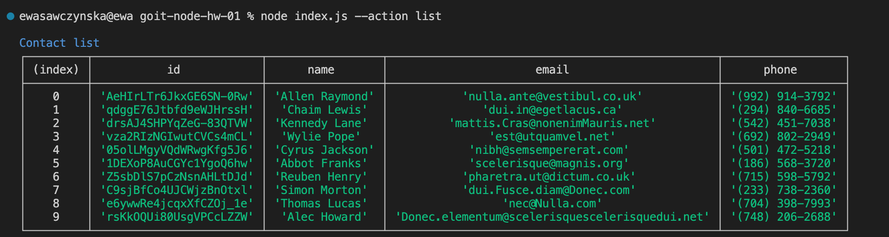
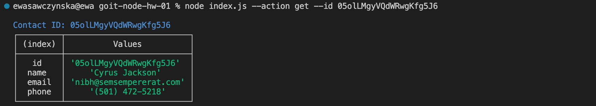
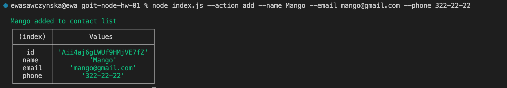
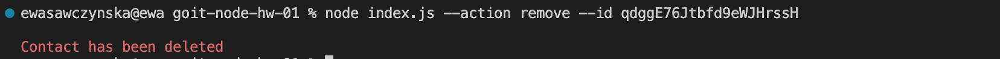

# CLI app: phonebook

Phonebook is an application which allows you to add, search and delete contacts.

## How-to run the app

```npm install``` install all dependencies
```npm start``` launch the app in production mode
```npm run start:dev``` launch the app in development mode

## How-to use the app

### Contacts list

```node index.js --action list```


### Get contact by ID

```node index.js --action get --id {ID}```


### Add contact

```node index.js --action add --name {name} --email {e-mail} --phone {phone}```


### Remove contact by ID

```node index.js --action remove --id {ID}```


